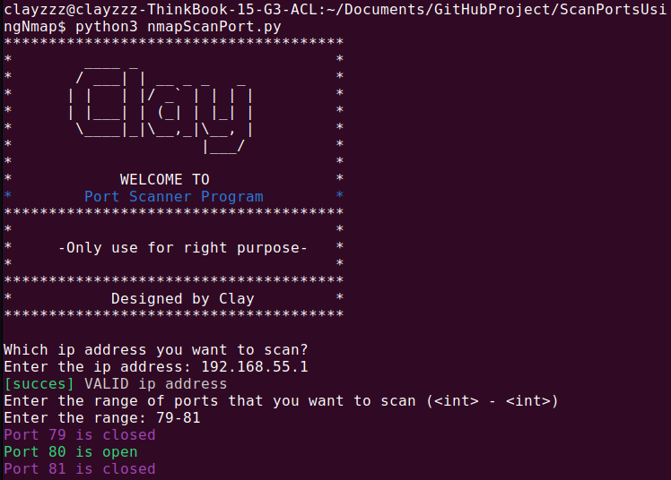

# ScanPortsUsingNmap
This program is used to find open ports in a device by using the python-nmap library. 

## Installation 
0. Install python: 
    `sudo apt install python3` 
1. Install pip: 
    `sudo apt install python3-pip`
2. Install nmap: 
    `pip install python-nmap` 
3. Install print-color: 
    `pip install print-color` 
4. To run the programing using: 
    `python3 nmapScanPort.py`

## Example: 

